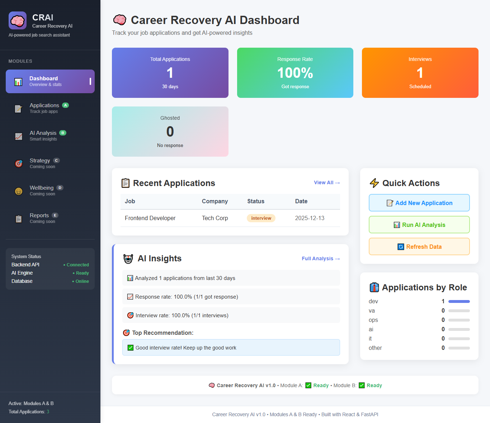
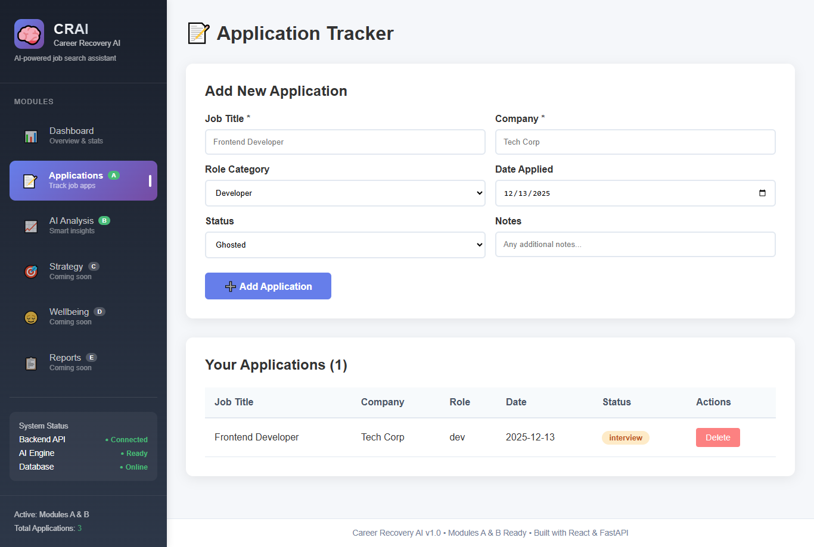
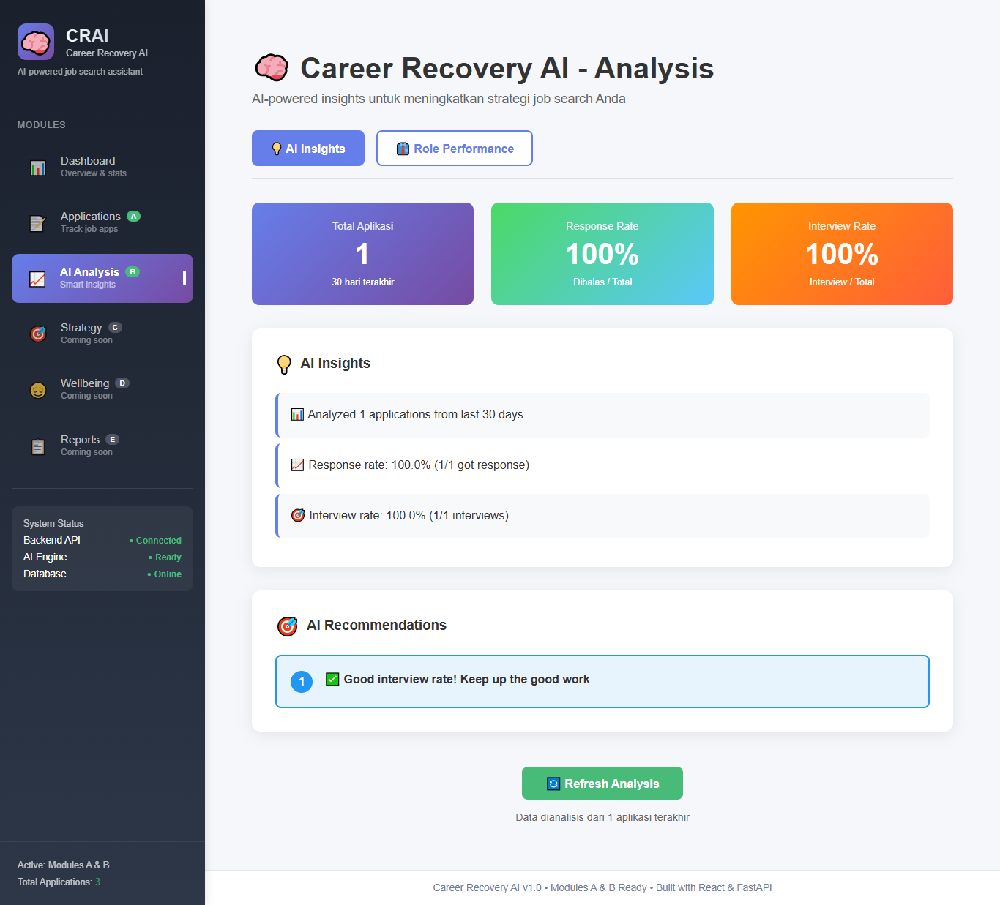

# 🧠 Career Recovery AI


[](https://fastapi.tiangolo.com/)
[](https://reactjs.org/)
[](https://www.python.org/)
[](https://www.sqlite.org/)

**AI-powered decision support system for long-term job seekers** - Analyzes rejection patterns, provides strategic recommendations, and prevents burnout during job search.

> 🎯 **Target**: Long-term unemployed individuals seeking data-driven job search strategies

## 🚀 Live Demo
---
- **Frontend**: [http://localhost:3000](http://localhost:3000) (after setup)
- **Backend API**: [http://localhost:8000/docs](http://localhost:8000/docs) (Swagger UI)
- **API Documentation**: [http://localhost:8000/redoc](http://localhost:8000/redoc)

## 📊 Project Overview
---
Career Recovery AI is **not another job tracker**. It's a **decision-support AI system** that:
- 🔍 Analyzes rejection patterns from your applications
- 🎯 Provides actionable "what to change next" recommendations  
- ⚡ Prevents burnout with intelligent pacing suggestions
- 📈 Tracks metrics that actually matter for long-term job search

### 🤔 Problem Solved
When you apply to dozens of jobs and get rejected:
- ❌ **Confusion**: "What should I change?"
- ❌ **Fatigue**: Apply → Reject → Burnout cycle  
- ❌ **Lack of Strategy**: Most tools only track, don't strategize

### ✅ Our Solution
- ✅ **Pattern Analysis**: AI identifies what's not working
- ✅ **Strategic Pivots**: Clear "stop/start/continue" recommendations
- ✅ **Burnout Prevention**: Monitors stress and suggests optimal pace
- ✅ **Weekly Reports**: Data-driven progress tracking

## 🏗️ Architecture
---

**Data Flow:**
1. **User Interface** ←→ **API Layer** ←→ **Data Storage**
2. **Business Logic** distributed across specialized modules
3. **Extensible design** for additional modules (D, E, etc.)

## 📁 Project Structure
---

## 📸 Screenshots
---
<div align="center">

### Dashboard


### Applications


### Analytics


</div>

## 🛠️ Tech Stack
---
### **Backend**
- **FastAPI** - Modern Python web framework
- **SQLAlchemy** - ORM for database operations
- **SQLite/PostgreSQL** - Database (SQLite for dev, PostgreSQL for prod)
- **Pydantic** - Data validation
- **Pandas** - Data analysis for rejection patterns

### **Frontend**
- **React 18** - UI library
- **Vite** - Build tool and dev server
- **React Router** - Client-side routing
- **Axios** - HTTP client
- **Inline Styles** - No CSS framework (will update when the backend powerfull)

### **AI/ML** (Planned)
- **OpenAI API** - LLM-powered insights
- **scikit-learn** - Pattern detection algorithms
- **Custom rule-based engine** - Hybrid approach

## 🚀 Quick Start

### Prerequisites
- Python 3.11+
- Node.js 18+
- Git

### 1. Clone Repository
```bash
git clone https://github.com/yourusername/career-recovery-ai.git
cd career-recovery-ai
```

### 2. Backend Setup
```bash
cd backend

# Create virtual environment
python -m venv venv

# Activate (Windows)
venv\Scripts\activate
# Activate (Mac/Linux)
source venv/bin/activate

# Install dependencies
pip install -r requirements.txt

# Run backend server
uvicorn app.main:app --reload --host 0.0.0.0 --port 8000
```

### 3. Frontend Setup
```bash
cd frontend

# Install dependencies
npm install

# Run development server
npm run dev
```

### 4. Test the System

1. Open http://localhost:3000 in browser

2. Add some job applications via "Applications" page

3. Go to "AI Analysis" to see pattern insights

4. Check API docs at http://localhost:8000/docs

## 📈 Modules Status

| Module | Icon | Status | Description |
|--------|------|--------|-------------|
| **A** | 📝 | ✅ **COMPLETE** | Application Tracker - CRUD operations & basic stats |
| **B** | 🧠 | 🟡 **MVP READY** | Rejection Pattern Analyzer - Rule-based AI analysis |
| **C** | 🎯 | 🚧 **PLANNED** | Strategy Pivot Engine - AI decision recommendations |
| **D** | 😌 | 🚧 **PLANNED** | Burnout & Survival Monitor - Stress tracking |
| **E** | 📋 | 🚧 **PLANNED** | Weekly Survival Report - Automated reporting |

🔍 Key Features
---

### ✅ Module A: Application Tracker
- **Add/edit/delete job applications**
- **Track status**: ghosted / rejected / interview / offer
- **Role categorization**: Dev / VA / Ops / AI / IT
- **Basic statistics dashboard**
- **Response rate calculation**

### ✅ Module B: Rejection Pattern Analyzer
- **Pattern detection by role category**
- **Interview rate vs rejection rate analysis**
- **Time-based trend analysis**
- **Simple rule-based recommendations**
- **Performance comparison across roles**

### 🚧 Planned Features
- OpenAI integration for smarter insights
- Skill recommendation engine
- Burnout risk detection
- Weekly PDF reports
- Export/import functionality
- Charts and data visualization

## 🎯 Target Metrics
---
The system aims to help users achieve:
- **30% increase in response rate** within 30 days
- **Reduced burnout risk** through intelligent pacing
- **Data-driven strategy pivots** based on actual performance
- **Actionable insights** instead of just statistics

## 🧪 Testing
---

### Backend Tests
```bash
cd backend
python test_api.py
```

### API Endpoints
```bash
# Test API is running
curl http://localhost:8000/

# Get all applications
curl http://localhost:8000/api/applications

# Get analysis insights
curl http://localhost:8000/api/analysis/quick-insights
```

## 🤝 Contributing
---
This is a personal learning project, but suggestions are welcome!

1. Fork the repository
2. Create a feature branch (git checkout -b feature/amazing-feature)
3. Commit your changes (git commit -m 'Add amazing feature')
4. Push to the branch (git push origin feature/amazing-feature)
5. Open a Pull Request

## 📄 License
---
This project is licensed under the MIT License - see the [LICENSE](LICENSE) file for details.

## 🙏 Acknowledgments
---

Built with ❤️ for job seekers struggling with long-term unemployment. The goal is to turn data into actionable insights and hope into strategy.

## 🗺️ Development Roadmap
---
| Phase | Status | Key Features |
|-------|--------|--------------|
| **1. Foundation** | ✅ **COMPLETE** | Basic tracking • Pattern analysis • React+FastAPI integration |
| **2. AI Enhancement** | 🔄 **IN PROGRESS** | OpenAI integration • Advanced detection • Personalization |
| **3. Advanced Features** | 📅 **PLANNED** | Burnout monitoring • Weekly reports • Dashboard • Export |
| **4. Production Ready** | ☁️ **FUTURE** | Cloud deployment • Auth • Mobile • Testing |

## 💡 Why This Project?
---

As a job seeker myself, I noticed:

**Job trackers only track**, they don't strategize  
**Rejection patterns are invisible** without analysis  
**Burnout is real** during long-term job search  
**Everyone needs a "what next"** after rejections  

This project aims to solve these problems with **data, AI, and empathy**.

## 📢 Support & Connect
---
- ⭐ **Star this repository** to show your support
- 🔗 **Connect with me** on [LinkedIn](https://www.linkedin.com/in/chelbapolandaa/)
- 💬 **Open an issue** for questions or suggestions

> *"The best way to predict the future is to create it." - Peter Drucker*
